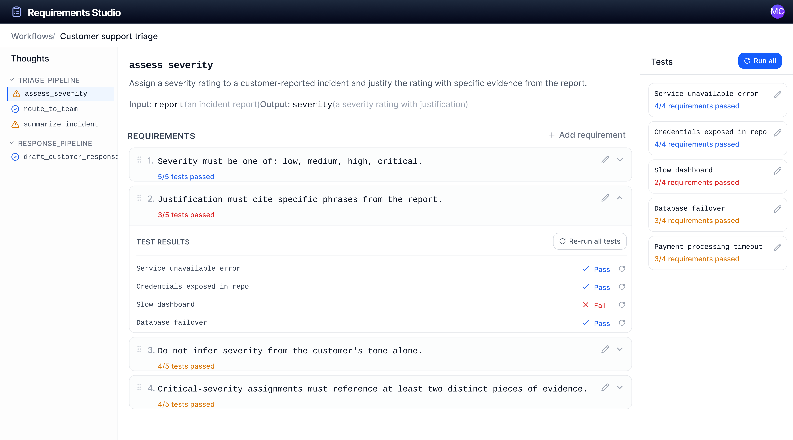

> [← Ch.16: Multi-Agent Patterns](16-multi-agent-patterns.md) · [Table of Contents](../README.md)

---

# Chapter 18: Human Interaction in Generative Systems

**Status:** Draft
**Version:** 0.1
**Authors:** Jessica He, Kush Varshney, Claude
**Date Created:** 2026-05-20
**Date Modified:** 2026-06-01

**Prerequisites:** Chapter 7 (Mellea Standard Library — IVR, encapsulation), Chapter 8 (Meaning and Thought), Chapter 9 (Decision Architecture), Chapter 12 (Unification, Traces, and Synthetic Data), Chapter 14 (Software-Defined Models), Chapter 15 (Security Across the Stack)

**Review History:**
| Reviewer | Date | Verdict | Notes |
|----------|------|---------|-------|

---

The preceding chapters focus primarily on system behavior: how it is structured, controlled, validated, and optimized. This chapter addresses the complementary question:
How do developers understand, interact with, and maintain agency in systems built on generative computing?

Generative computing introduces a new interaction paradigm. Developers rely less on brittle prompt engineering; instead, they provide intent as Meanings and shape system behavior through requirements, validation, policies, and explicit decision logic over a probabilistic system whose execution is structured through Thought sequences, grammar constraints, and IVR loops. This shift does not eliminate the need for human understanding and control—on the contrary, it amplifies it. With this new interaction paradigm comes the need for new forms of transparency, specification, intervention, and mental models for working effectively with programmable yet probabilistic systems.

## 18.1 Transparency

### Novel Forms of Transparency

Generative computing enables new forms of transparency. In generative AI systems, behavior is often a black box, with little visibility into how outputs are produced. In generative computing, traces (Chapter 12) can provide insight into not only what the system produced, but also how it got there: which Thoughts were selected, what inputs they consumed, how outputs were validated, and whether repairs were applied. This enables auditing, post-hoc analysis, and attribution of failure to specific Thought selections or executions, rather than treating the system as a monolithic entity.

This shift changes how developers can approach failure modes. Many failures in generative systems do not manifest as explicit errors; an output may appear fluent and coherent while being incorrect, incomplete, or misaligned with requirements. Without trace-level visibility, these failures are difficult to detect. With structured transparency, developers can inspect intermediate steps and identify exactly where the process broke down—for example, whether decomposition omitted a critical subtask, grounding failed, or a validation requirement did not trigger as expected.

Because Thought descriptions, Meaning intents, requirements, and decision rationales are all named and typed, the system can render structured explanations directly from the artifacts that govern its behavior, such as pipeline summaries, requirement catalogs, and per-Thought specifications generated from the same definitions the runtime executes. This rendering is most useful when the toolchain treats it as a first-class output of the pipeline rather than a side effect of how the artifacts happen to be named, since documentation produced this way stays consistent with system behavior as the artifacts evolve.

The example below illustrates an auto-rendered explanation for a two-Thought pipeline that triages customer-reported incidents by assigning a severity rating, then routing the incident to an on-call team.

---

#### `triage_pipeline` — generated 2026-05-28

**Inputs.** `report` *(an incident report)*

**Outputs.** `triage_decision` *(a routing decision)*

**Sequence.**

| # | Thought | Reads | Writes | Validation strategy |
|---|---|---|---|---|
| 1 | `assess_severity` | `report` | `severity` | `repair (3 attempts)` |
| 2 | `route_to_team` | `report`, `severity` | `triage_decision` | `default` |

**Requirements in force.**

- `assess_severity`
  - Severity must be one of: low, medium, high, critical.
  - Justification must cite specific phrases from the report.
  - Do not infer severity from the customer's tone alone.
- `route_to_team`
  - Team name must be one of the registered on-call rotations.
  - Critical incidents must route to the incident-commander rotation.

**Empirical behavior** *(last 7 days, 1,428 runs)*

| Stage | IVR pass rate | Avg. attempts | Most-failed requirement |
|---|---|---|---|
| `assess_severity` | 94.1% | 1.07 | "Justification must cite specific phrases from the report." (5.1%) |
| `route_to_team` | 99.6% | 1.00 | — |

**Degradation paths.** `assess_severity` returns a degraded Meaning when the repair budget is exhausted. Downstream, `route_to_team` reads the `degraded` flag on `severity` and falls back to the incident-commander rotation.

---

### Novel Information Needs

This type of structured transparency can also support the novel information needs created by generative computing. These needs are particularly salient during trust calibration and error recovery.

During early adoption, generative computing introduces unfamiliar abstractions, such as Thought pipelines and IVR loops, that developers must become familiar with in order to trust. Inspecting traces for these abstractions allows them to gauge whether requests are interpreted correctly, tasks are decomposed sensibly, and results are grounded. As trust stabilizes, the need for inspection may decrease, but this transparency is critical during the initial understanding phase.

Novel information needs also arise in failure cases as developers must diagnose where and why breakdowns occur. Developers need visibility into Thought selection, validation outcomes (i.e., which requirements failed), IVR behavior (e.g., number of attempts and repair success), and degradation paths (§8.2.7). Yet many generative abstractions obscure this information—for example, m.instruct() and IVR loops (§7.3) collapse multiple attempts and repairs into a single output. Without access to intermediate steps, debugging becomes guesswork. The example in §18.1 concretizes how this information can be surfaced to developers.

To prevent information overload, transparency can be surfaced through a dual interaction model: a default mode, where abstraction and encapsulation hold, and an inspect mode, where traces, validation results, and decision records (§9.4) are exposed.

### :thought_balloon: Opportunities for User Research
* What types of information do different stakeholders need at different stages in a workflow (e.g., onboarding, regular operations, failure modes)?
* How should this information be surfaced in a way that is actionable, unobtrusive, and tailored to a user's knowledge?
* How can we scale inspection to long-running pipelines or high-traffic production?

## 18.2 Human Intervention

Human intervention in generative computing serves three important purposes: recovery from failures that automated repair cannot resolve, clarity on decisions where automated signals are uncertain, and developer engagement with any faulty artifacts that they might otherwise accept without scrutiny.

### Intervention in Failure and Degradation

Chapter 8 identifies human intervention as one of the possible outcomes when automated recovery fails (§8.2.7). This chapter generalizes that observation: human intervention is not merely a fallback, but a fundamental component of generative system design. When a Thought fails validation repeatedly, the system may escalate to a human rather than continuing retries or returning a degraded result. For example, a task requiring external verification, such as confirming a legal citation, may be routed to a human reviewer after several failed validation attempts. The system preserves the context of the failed execution, enabling the human to intervene with full visibility.

### Intervention at Decision Boundaries

Human feedback can also be integrated directly into the system's decision-making process. As formalized in the Decision Architecture (§9), execution consists of selecting an action a ∈ A given a context c. In many cases, this selection is uncertain—for example, when deciding whether to proceed, request clarification, or revise a prior result. At these decision boundaries, the system can surface its choices to a person, presenting available actions alongside context signals. Human input can then be recorded as a new field in `DecisionRecord` such that the trace captures both automated signals and human judgment.

This integration can improve performance and accuracy by enabling hybrid policies that combine continuous automation with selective human input, particularly in cases where signals are uncertain or noisy. Decision policies can range in autonomy: fully autonomous (system decisions are final), conditionally autonomous (system or human makes final decision depending on context), human input required, or human-led with AI-assistance. The selected policy will depend on the types of institutional oversight applicable to the use case (i.e., organizational, industry, or regulatory requirements). For example, high stakes domains, such as medical, legal, or financial applications, are likely to operate under a "human input required" or "human-led with AI-assistance" policy to preserve human responsibility and accountability.

Together, these patterns reposition human involvement as active participation, where people can guide, validate, and assume responsibility for system behavior at critical points. These patterns also support developer engagement to address a complementary risk: human overreliance. Just as developers may under-trust unfamiliar abstractions, they may over-trust faulty artifacts without thorough evaluation. This is the same acceleration vs. exploration pattern that arises with code-generation tools, where rapid acceptance of plausible suggestions concentrates risk. Built-in intervention points can serve as "cognitive forcing functions" that align attention with the moments that most affect outcomes.

### :thought_balloon: Opportunities for User Research
* What are developers' and reviewers' preferences and tolerance levels for different levels of autonomy vs. intervention? How can we prevent intervention fatigue?
* How does delegation evolve as trust evolves? How can the system support dynamic policies to reflect evolving user needs?
* What are the social dynamics of human-in-the-loop intervention in teams? For example, are there individual differences in decision-making, and how can we preserve context between team members?

## 18.3 Specification

### Novel Specification Needs

Generative computing introduces a new form of specification that sits between command-based and intent-based outcome specification paradigms (as coined by Jakob Nielsen). Developers no longer specify exact steps as they did in traditional programming, where deterministic execution, exact-match testing, and error localization are expected. They also no longer describe desired intents as natural language instructions, as required by prompt engineering.

Generative computing sits between these paradigms: programs are structured via Thoughts, scopes, requirements, but execute on a stochastic engine; failures are localizable (decision records, IVR outcomes) but rarely reduce to a single line of code. This shift poses both opportunities and challenges, and it requires a corresponding shift in mental models.

Requirements (§7.3) are one of the most visible components of this specification, and they exemplify a new mental model that developers must adapt to. Requirements serve as both an instruction to the generator and a contract with the validator that consumes it. A requirement worded for clarity to the generator may be hard for an LLM judge to evaluate; a requirement worded for evaluability may bias the generator. This dual obligation is a core difficulty of specification in generative computing, and bridging it requires inspection (§18.1) as the operational complement to specification — a developer who cannot see how a requirement is interpreted by both sides cannot iterate on it effectively. Furthermore, requirements may interact in non-obvious ways. Changing the order of requirements can influence outputs, and specifying multiple constraints can lead to trade-offs that the system must resolve. Detecting which requirement failed and why is not always straightforward, particularly when validation involves LLM-based checks.

To support this new paradigm, developers need tools for authoring and organizing requirements, testing them across representative inputs, identifying trade-offs and failures, and iterating on constraints.

The following prototype shows an example of a tool for authoring and testing requirements.

*Created with Figma Make*

### Modes of Specification

The preceeding sections assume that developers will write Mellea programs directly, but whether this assumption holds remains an open question. In practice, Mellea may occupy a level of abstraction similar to bytecode. Just as most developers work in higher-level languages that compile down to bytecode, they may also author Mellea programs through higher-level formats, such as natural language specification, rather than engaging with Mellea directly.

The Mellea Skills Compiler operationalizes this alternative means of specification by taking a natural-language skill specification and compiling it into a typed Mellea pipeline package, complete with Pydantic schemas, generative slots, requirement validators, and orchestration code, all without requiring the developer to engage directly with Mellea abstractions. Furthermore, contradictions in the source specification are surfaced as testable failures rather than silently resolved, making the compilation step itself a form of structured analysis of the developer's intent. In this interaction paradigm, Mellea becomes an intermediate artifact that governs execution but is no longer the primary input nor output inspected by the developer.

In this interaction paradigm, the question becomes how to design natural language compilers or visual authoring tools (see prototype above) that convey useful mental models of the underlying architecture to enable developers generate and modify Mellea programs without exposing the full language surface. This interaction paradigm raises additional developer needs and considerations. If most developers never read the Mellea programs that govern their pipelines, the transparency and debuggability properties described in §18.1 and §18.2 become harder to exercise, as developers cannot inspect a trace that they do not have the vocabulary to interpret. One artifact that can help address this gap is the mapping report produced by the Skills Compiler, which provides a human-readable rendering that links each compiled artifact back to the original natural-language spec. Another approach is to preserve the natural-language spec as a first-class artifact alongside the generated program, so that version control, auditing, and diffing can operate at a level understood by the developer.

### :thought_balloon: Opportunities for User Research
* How might we support developers in building useful mental models to work effectively with generative computing? What resources are needed?
* What are developers' preferred workflows and levels of abstraction for defining and refining requirements, and how might we design tooling to support their needs?

## 18.4 Generative Computing in Practice

Lastly, we outline practical considerations for supporting the adoption of generative computing into user workflows.

### Roles and Collaboration

Generative computing distributes responsibility across multiple layers, and in practice, this will likely correspond to multiple roles. One individual may define requirements, a separate domain expert may contribute knowledge that shapes those requirements, and another developer may integrate the system into a larger workflow. This division of labor reflects the complexity of the system -- rather than a single-layer abstraction, generative computing comprises a stack that spans reasoning, control, and deployment (§14).

Each layer of the stack provides natural artifacts that mediate cooperation between roles that don't share a vocabulary. For example, Meanings can mediate between domain experts and developers — both can describe an artifact at a higher level that is appropriate and accessible for these roles. Thoughts can mediate between prompt engineers and policy designers, both of whom can read type signatures and requirements and may require greater granularity. Traces can mediate across all roles for post-hoc analysis. Reviewing changes to these artifacts requires interfaces that match their structure: a pull request can carry a trace diff alongside the code diff, a requirement coverage diff, and an SDM definition diff (§14.5) showing whether the change preserves or modifies the pipeline's guarantee tier.

### Attribution, Accountability, and Disclosure

The distributed nature of generative computing systems complicates attribution and accountability. When an output is incorrect or harmful, responsibility cannot be attributed to a single component. Instead, it must be analyzed across layers:
- Was the input context misinterpreted? (signal error)
- Was the wrong Thought selected? (policy error)
- Was the Thought executed poorly? (execution error)
- Who was responsible for each layer?

The trace structure (§12) provides a basis for this analysis by enabling more precise, post-hoc attribution to specific stages of execution and the people in charge of each stage. However, accountability remains an open question given the multitude of roles and individuals who may be involved in shaping system behavior.

This complexity also raises questions of disclosure, particularly in contexts with legal requirements for transparency (e.g., EU AI Act, Article 50). The structured trace again provides a foundation for such disclosure. Rather than relying on generic labels, systems can report on specific components, such as the execution of Thought sequences, instances and outcomes of human intervention, and how outputs were validated or refined. Empirical work on co-creation has shown that perceptions of AI authorship are nuanced — people assign different levels of credit based on the type, amount, and initiative of contribution. These granularity dimensions map directly onto trace metadata the runtime already maintains, so the toolchain can render disclosures that meet these requirements without imposing additional manual burden on developers.

### Bridging Capability and Utility

Finally, as generative computing is still an emerging paradigm, there remains a gap between capability and utility. The novelty of its abstractions can obscure its practical value, and developers may struggle to identify appropriate use cases. Addressing this gap requires user research to understand how generative computing can integrate with and improve existing workflows. Educational resources beyond documentation can help lower the barrier to entry, such as end-to-end sample use cases and domain-specific patterns of use that help practitioners understand where generative computing can benefit them. The success of generative computing ultimately depends not only on the power of the underlying technology, but on how well it supports the people who use it in understanding, evaluating, and leveraging what it produces.

### :thought_balloon: Opportunities for User Research
* Which job roles will be involved in implementing generative computing, and what will cross-role collaboration look like?
* How do different stakeholders (e.g., developers, end users, regulatory bodies) assign attribution and accountability in generative computing systems? How might we resolve any tensions between different stakeholders?
* What use cases are suitable vs. unsuitable for generative computing, and how can we convey them to practitioners?

---

> [← Ch.16: Multi-Agent Patterns](16-multi-agent-patterns.md) · [Table of Contents](../README.md)
